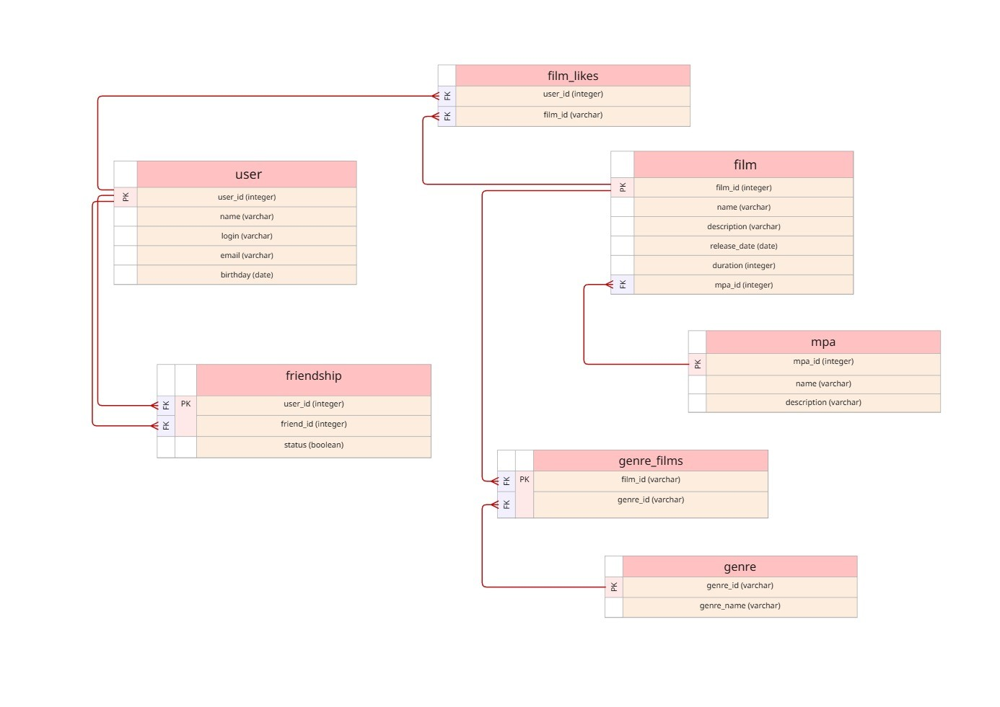

# java-filmorate


Примеры запросов:

Получить фильм по ID (включая рейтинг MPA и жанры)
```sql
SELECT f.*, m.name AS mpa_name, m.description AS mpa_description
FROM films f
LEFT JOIN mpa m ON f.mpa_id = m.mpa_id
WHERE f.id = 1;
```

Добавить новый фильм
```sql
INSERT INTO films (name, description, releaseDate, duration, mpa_id)
VALUES ('Inception', 'Sci-Fi Thriller', '2010-07-16', 148, 3);
```
Обновить фильм
```sql
UPDATE films
SET name = 'Inception (2010)', duration = 150
WHERE id = 1;
```

Получить пользователя по ID
```sql
SELECT * FROM users WHERE id = 1;
```

Добавить нового пользователя
```sql
INSERT INTO users (email, login, name, birthday)
VALUES ('user@mail.ru', 'john_doe', 'John Doe', '1990-01-01');
```

Получить жанр по ID
```sql
SELECT * FROM genres WHERE genre_id = 1;
```

Получить рейтинг конкретного фильма
```sql
SELECT m.*
FROM mpa m
JOIN films f ON m.mpa_id = f.mpa_id
WHERE f.id = 1;
```

Поставить лайк фильму
```sql
INSERT INTO film_likes (film_id, user_id) VALUES (1, 10);
```

Получить список друзей пользователя
```sql
SELECT u.*
FROM users u
JOIN friendship f ON u.id = f.friend_id
WHERE f.user_id = 1;
```

Template repository for Filmorate project.
